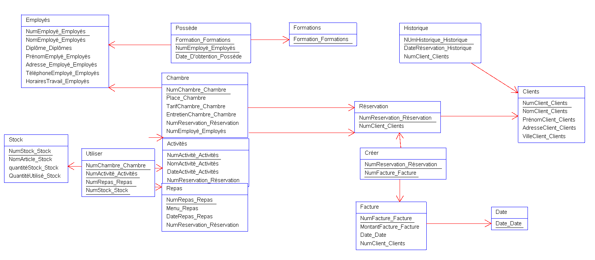

# Examen Modélisation de données

 **Sujet d'étude :**
 
 Conception d'un système de gestion intégré pour une chaîne hôtelière de luxe en utilisant la méthode MERISE.

 ## Enoncé du projet :

Une chaîne hôtelière de luxe souhaite moderniser son système de gestion pour optimiser ses opérations, offrir une expérience client exceptionnelle et améliorer l'efficacité de son personnel. Vous êtes sollicité en tant que consultant en systèmes d'information pour concevoir un système de gestion intégré, couvrant tous les aspects de l'entreprise, en utilisant la méthode MERISE.


### Dictionnaire de données :


### MCD :


### MLD


### MPD

Employés (NumEmployé_Employés, NomEmployé_Employés, Diplôme_Diplômes, PrénomEmplyé_Employés, Adresse_Employé_Employés, TéléphoneEmployé_Employés, HorairesTravail_Employés)  
Formations (Formation_Formations)  
Chambre (NumChambre_Chambre, Place_Chambre, TarifChambre_Chambre, EntretienChambre_Chambre, #NumReservation_Réservation, #NumEmployé_Employés)  
Clients (NumClient_Clients, NomClient_Clients, PrénomClient_Clients, AdresseClient_Clients, VilleClient_Clients)  
Réservation (NumReservation_Réservation, #NumClient_Clients)  
Facture (NumFacture_Facture, MontantFacture_Facture, #Date_Date, #NumClient_Clients)  
Activités (NumActivité_Activités, NomActivité_Activités, DateActivité_Activités, #NumReservation_Réservation)  
Stock (NumStock_Stock, NomArticle_Stock, quantitéStock_Stock, QuantitéUtilisé_Stock)  
Date (Date_Date)  
Repas (NumRepas_Repas, Menu_Repas, DateRepas_Repas, #NumReservation_Réservation)  
Historique (NUmHistorique_Historique, DateRéservation_Historique, #NumClient_Clients)  
Possède (Formation_Formations, NumEmployé_Employés, Date_D'obtention_Possède)  
Créer (NumReservation_Réservation, NumFacture_Facture)  
Utiliser (NumChambre_Chambre, NumActivité_Activités, NumRepas_Repas, NumStock_Stock) 


 ```sql
 CREATE TABLE Employés 
 (NumEmployé_Employés INT(10) AUTO_INCREMENT NOT NULL, NomEmployé_Employés VARCHAR(200), Diplôme_Diplômes VARCHAR(50), PrénomEmplyé_Employés VARCHAR(200), Adresse_Employé_Employés VARCHAR(200), TéléphoneEmployé_Employés INT(50), HorairesTravail_Employés DATETIME, PRIMARY KEY (NumEmployé_Employés) CONSTRAINT Employés
 ;)  
 
 CREATE TABLE Formations 
 (Formation_Formations VARCHAR(200) AUTO_INCREMENT NOT NULL, PRIMARY KEY (Formation_Formations)) ENGINE=InnoDB;  DROP TABLE IF EXISTS Chambre ; CREATE TABLE Chambre (NumChambre_Chambre INT(200) AUTO_INCREMENT NOT NULL, Place_Chambre INT(50), TarifChambre_Chambre INT(50), EntretienChambre_Chambre VARCHAR2(200), NumReservation_Réservation INT (200), NumEmployé_Employés INT (200), PRIMARY KEY (NumChambre_Chambre) CONSTRAINT Formations
 );  
 
 CREATE TABLE Clients (NumClient_Clients INT(50) AUTO_INCREMENT NOT NULL, NomClient_Clients VARCHAR(200), PrénomClient_Clients VARCHAR(200), AdresseClient_Clients VARCHAR(200), VilleClient_Clients VARCHAR(200), PRIMARY KEY (NumClient_Clients) CONSTRAINT Clients
 );  
 
 CREATE TABLE Réservation 
 (NumReservation_Réservation INT(50) AUTO_INCREMENT NOT NULL, NumClient_Clients INT (50), PRIMARY KEY (NumReservation_Réservation) CONSTRAINT Réservation
 );  
 
 CREATE TABLE Facture 
 (NumFacture_Facture INT(50) AUTO_INCREMENT NOT NULL, MontantFacture_Facture INT(50), Date_Date INT (50), NumClient_Clients INT (50), PRIMARY KEY (NumFacture_Facture) CONSTRAINT Facture
 );  
 
 CREATE TABLE Activités 
 (NumActivité_Activités INT(50) AUTO_INCREMENT NOT NULL, NomActivité_Activités VARCHAR(200), DateActivité_Activités DATETIME, NumReservation_Réservation INT (50), PRIMARY KEY (NumActivité_Activités) CONSTRAINT Activités
 );  
 
 CREATE TABLE Stock 
 (NumStock_Stock INT(50) AUTO_INCREMENT NOT NULL, NomArticle_Stock VARCHAR(200), quantitéStock_Stock INT(50), QuantitéUtilisé_Stock INT(50), PRIMARY KEY (NumStock_Stock) CONSTRAINT Stock
 );  
 
 CREATE TABLE Date 
 (Date_Date DATE AUTO_INCREMENT NOT NULL, PRIMARY KEY (Date_Date) CONSTRAINT Date
);  
 
 CREATE TABLE Repas 
 (NumRepas_Repas BIGINT(50) AUTO_INCREMENT NOT NULL, Menu_Repas VARCHAR, DateRepas_Repas DATETIME, NumReservation_Réservation INT (50), PRIMARY KEY (NumRepas_Repas) CONSTRAINT Repas
 );  
 
 CREATE TABLE Historique 
 (NUmHistorique_Historique INT(50) AUTO_INCREMENT NOT NULL, DateRéservation_Historique DATETIME, NumClient_Clients INT (50), PRIMARY KEY (NUmHistorique_Historique) CONSTRAINT Hostorique  
 ;)
 
 CREATE TABLE Possède 
 (Formation_Formations INT (200) AUTO_INCREMENT NOT NULL, NumEmployé_Employés INT (200) NOT NULL, Date_Obtention_Possède DATE, PRIMARY KEY (Formation_Formations,  NumEmployé_Employés) CONSTRAINT Possède
   );
 
 CREATE TABLE Créer 
 (NumReservation_Réservation INT (50) AUTO_INCREMENT NOT NULL, NumFacture_Facture INT (50) NOT NULL, PRIMARY KEY (NumReservation_Réservation,  NumFacture_Facture) CONSTRAINT Créer
 );  
 
 CREATE TABLE Utiliser 
 (NumChambre_Chambre INT *(200) AUTO_INCREMENT NOT NULL, NumActivité_Activités INT (200) NOT NULL, NumRepas_Repas INT (200) NOT NULL, NumStock_Stock INT (200) NOT NULL, PRIMARY KEY (NumChambre_Chambre,  NumActivité_Activités,  NumRepas_Repas,  NumStock_Stock) CONSTRAINT Utiliser
 );  
 
 
 ALTER TABLE Chambre ADD CONSTRAINT FK_Chambre_NumReservation_Réservation FOREIGN KEY (NumReservation_Réservation) REFERENCES Réservation (NumReservation_Réservation);

 ALTER TABLE Chambre ADD CONSTRAINT FK_Chambre_NumEmployé_Employés FOREIGN KEY (NumEmployé_Employés) REFERENCES Employés (NumEmployé_Employés);

 ALTER TABLE Réservation ADD CONSTRAINT FK_Réservation_NumClient_Clients FOREIGN KEY (NumClient_Clients) REFERENCES Clients (NumClient_Clients);

 ALTER TABLE Facture ADD CONSTRAINT FK_Facture_Date_Date FOREIGN KEY (Date_Date) REFERENCES Date (Date_Date);

 ALTER TABLE Facture ADD CONSTRAINT FK_Facture_NumClient_Clients FOREIGN KEY (NumClient_Clients) REFERENCES Clients (NumClient_Clients);

 ALTER TABLE Activités ADD CONSTRAINT FK_Activités_NumReservation_Réservation FOREIGN KEY (NumReservation_Réservation) REFERENCES Réservation (NumReservation_Réservation);

 ALTER TABLE Repas ADD CONSTRAINT FK_Repas_NumReservation_Réservation FOREIGN KEY (NumReservation_Réservation) REFERENCES Réservation (NumReservation_Réservation);

 ALTER TABLE Historique ADD CONSTRAINT FK_Historique_NumClient_Clients FOREIGN KEY (NumClient_Clients) REFERENCES Clients (NumClient_Clients);

 ALTER TABLE Possède ADD CONSTRAINT FK_Possède_Formation_Formations FOREIGN KEY (Formation_Formations) REFERENCES Formations (Formation_Formations);

 ALTER TABLE Possède ADD CONSTRAINT FK_Possède_NumEmployé_Employés FOREIGN KEY (NumEmployé_Employés) REFERENCES Employés (NumEmployé_Employés);

 ALTER TABLE Créer ADD CONSTRAINT FK_Créer_NumReservation_Réservation FOREIGN KEY (NumReservation_Réservation) REFERENCES Réservation (NumReservation_Réservation);

 ALTER TABLE Créer ADD CONSTRAINT FK_Créer_NumFacture_Facture FOREIGN KEY (NumFacture_Facture) REFERENCES Facture (NumFacture_Facture);

 ALTER TABLE Utiliser ADD CONSTRAINT FK_Utiliser_NumChambre_Chambre FOREIGN KEY (NumChambre_Chambre) REFERENCES Chambre (NumChambre_Chambre);

 ALTER TABLE Utiliser ADD CONSTRAINT FK_Utiliser_NumActivité_Activités FOREIGN KEY (NumActivité_Activités) REFERENCES Activités (NumActivité_Activités);

 ALTER TABLE Utiliser ADD CONSTRAINT FK_Utiliser_NumRepas_Repas FOREIGN KEY (NumRepas_Repas) REFERENCES Repas (NumRepas_Repas);

 ALTER TABLE Utiliser ADD CONSTRAINT FK_Utiliser_NumStock_Stock FOREIGN KEY (NumStock_Stock) REFERENCES Stock (NumStock_Stock);
 