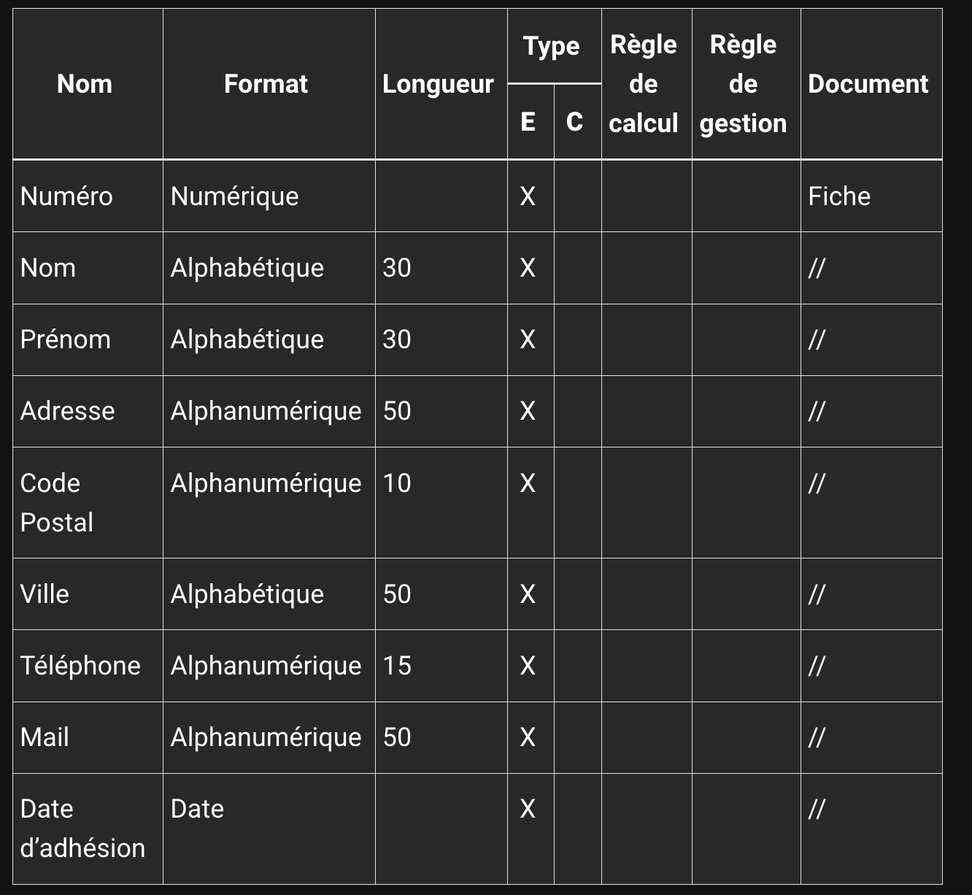
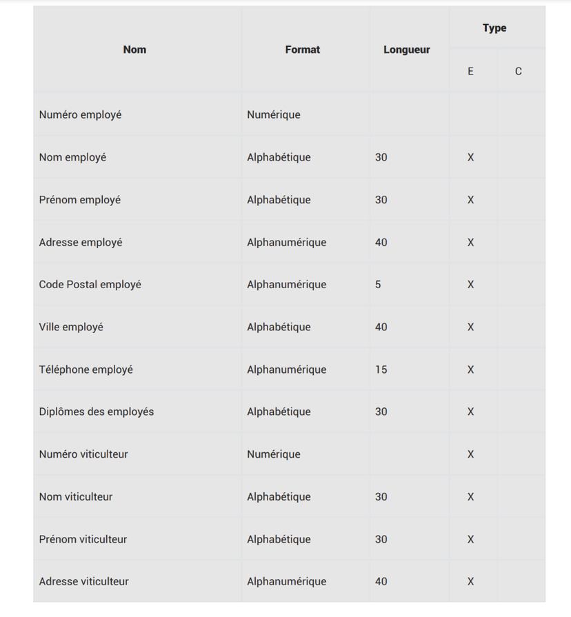
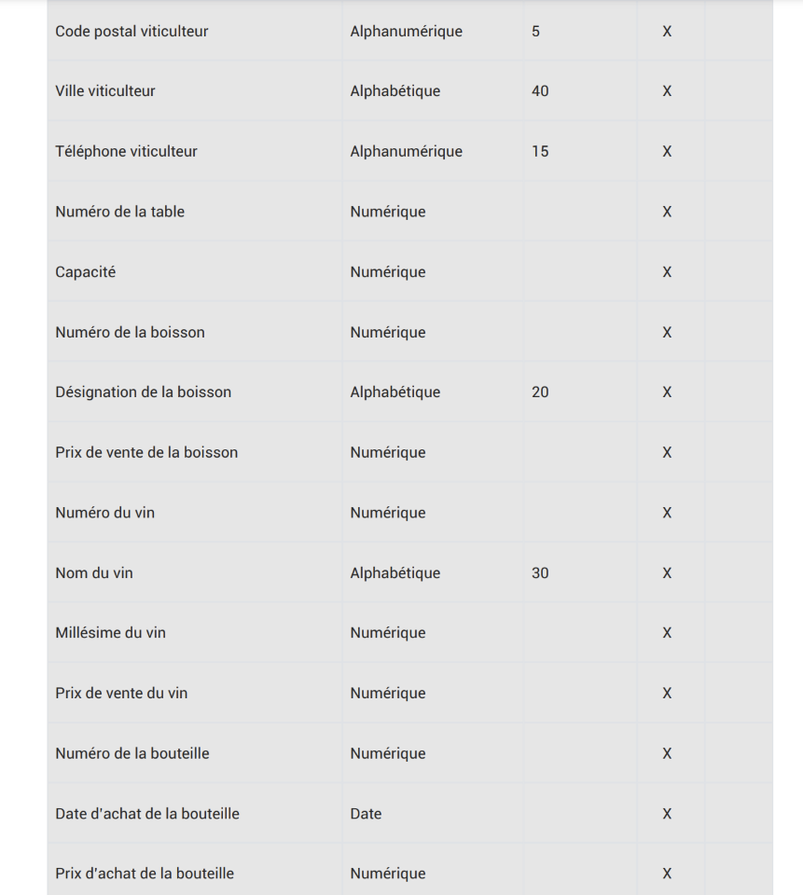
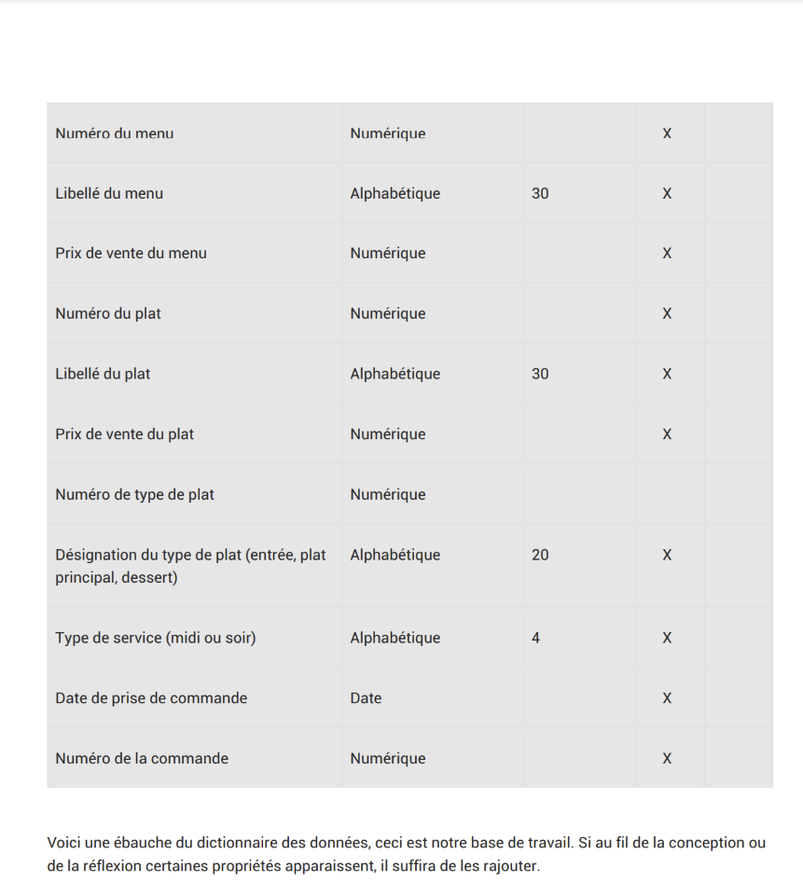
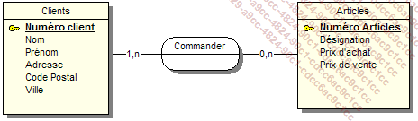

# Lancer GIT
### Commande pour la configuration
-   Initialisation d'un dépot Git :

``` sh
git init
```

-   Pour ajouter des fichiers non suivis :

```sh
git add
```

-   Pour sauvegarder votre travail :

``` bash
git commit -m "votre message de commit"
```

-   Pour voir le status du depot git :

```sh
git status
```

# Merise

-   C'est une methode de modelisation de données.
-   Représente les données d'un système d'information.
-   Merise = Méthode d'Etude et de Réalisation Informatique pour les Systeme d'Entreprise.

## Présentation generale
Cette methode se caraterise par trois point clés:
-   Une approche dite systemique : On transforme les processus de l'entrprise en systeme d'infomation.
-   Une separations des données et des traitements
-   Une approche nivelée

### L'approche systemique


Le systeme de pilotage :
-    Il est compose de l'ensemble des acteurs qui vont piloter le systeme d'information

Le systeme d'information :
-   Il est compose de l'ensemble des avteurs qui vont **utiliser** le system d'information

Le systeme operant : 
-   Il est compose de l'ensemble des acteurs qui vont **produire** les données du systeme d'information.
<br>
<br>
### La separation des données et des traitements
==> Permet de separer les données du systeme d'information et les traitements effectues sur ces données.
Cette demarche s'effecrue en 3 étapes :
-   L'analyse des flux : on analyse les flux d'information entre les acteurs du systeme d'information et les avteurs du systeme operant.
-   L'étude des documents interne (factures, bon de livraison ect...)

Les differents type d'information:
-   Les infos de base ou elementaire : ce sonr les données de base du sysyteme d'information.
-   Les informations calculées : ce sont les données calculées a partir des données de base.
-    Les traitements ou les fonctions : ce sont les traitements effectués sur les données de base pour obtenir les données calculées.

En résume : vous devrez identifiées les données et les traitemens effectués sur ces données.
<br>

### L'approche nivelée
4 niveaux :<br>
-   Le niveau conceptuel
-   Le niveau organisationnel
-   Le niveau logique
-   Le niveau physique

#### Le niveau conceptuel 

Modeliser les données de l'entreprise en utilisant un MCD (Modele de conception de données) pour modeliser les données de l'entrprise

#### Le niveau organisationnel

Le niveau organisationnel va permettres d'integrer a l'analyse precedentes toutes les notions de temporalité, de chronologie des opérations, de contraintes geographique, niveau d'acces. On va utiliser le modèle organisationnel 

### Le niveau logique
Le niveau logique va permettre de modéliser les données de l'entreprise en utilisant le modèle logique de données (MDL) et les traitements de l'entreprise en utilisant le modèle logique des traitements (MLT)

Le MDL est independant des languages de programmation et des SGBD (Systeme de gestion de base de données)

On répond la question : **Avec quoi** les traitements sont ils effectués?

#### LE niveau physique
Organisation réelle des données eb utilisant le modele physique des traitements (MPT)
Ici, on apporte les solutions technique de stockage des données et de traitement des données
On repond a la question : **Comment** les traitements sont-ils effectuées?

#### Des données aux independance fonctionnelles

Pour être intégrées dans un systeme d'info, les données doivent être triées et organisées. On va souvent les classer par type dennées :

-   Chaines de caracteres, format texte
-   Type alphanumerique, format texte
-   Le type numerique (Intefrer, float, ...)
-   Le type date (date, datetime, timestamp)
-   Le logique ou booleen(true,fals)

<br>

## Exercice

Création d'un dictionnaire de données :



### Les dependances fonctionnelles

Une dépendance fonctionnelle est une relation entre deux attributs d'une table. Elle permet de definir une relation de dependance entre deux attributs d'une table.

Le role d'une dependance fonctionnelle est de permettre de definir une relation de dependance entre deux attributs d'une table:une donnés A depend focntionnellement d'une donnée B lorsque la valeur de B determine la valeur A.

Pour formaliser une dependance focntionnelle on utilise la notation suivante :
`Numero adherent (Nom, prenom, code postale, ville, téléphone, date d'adhesion, mail)`
La partie gauche (numéro adherant) est la `source` de la dependance fcontionnelle.
LA partie droite designe le `but` de la dependance.

### Les dependance fonctionnelles composes

Si une dependance fonctionnelle qui fait intervenir plus de deux attributs on parle de dependance fonctionnelle composée.

Exemple: Pour connaitre le temps d'un coureur sur une etape donnée il nous faut son numéro ou son nom ainsi que le nom ou le numéro de l'etape.

Formalisation :
`(numéro coureur, numéro étape)(temps)`

### Les dependance focntionnelle élémentaire

Une dependance fonctionnelle A -> B est élémentaire s'il n'existe pas une donnée C, sous-ensemble de A, decrivant une dependance fcontionnelle type C -> B.
Exemple :
-   RefProduit -> LibelleProduit
-   NumCommande RefProduit -> QuantiteCommanée
-   <strike>NumCommande RefProduit -> designationProduit</strike>

### Les dependance focntionnelle élémentaire
"on dit que la dependance fcontionnelle A -> B est directe s'il n'existe aucun attribut C tel que 
## Sujet TP/TD MCD jour 1

### Bibliothèque 





-   Le but de l'exercice est d'elaborer un MCD a partir d'un dictionnaire de données.
Nous allons introduire les notions d'entite, de relation et de propriétés.
-   Utilisation de l'application analyseSI pour la création du MDC

#### Les propriétés sont les infos de base d'un SI

#### Les entités sont les objets du SI

#### Les relations 

#### **Les cardinalités**: elles permettent de définir le nombre d'occurences d'une entité par rapport à une autre entité

<br>
Quelques regles de conception :

-   Toute entité doit avoir un identifiant
-   Toutes les proprietes dependent fonctionnellement de l'identifiant
-   Le nom d'une propriété ne doit apparaitre qu'une seul fois dans le MCD : si vous avez une entité Elevé et une entité proffesseur, vous ne pouvez pas avoir une propriété nom dans les deux entités. Il faut donc renommer le propriété nom de l'entité Professeur en nomProfesseur par exemple.
-   Les propriétés issues d'un calcule ne doivent pas apparaitre dans le MCD.


### Pour lancer analyseSI avec java: 
``` bash
    java -jar .\AnalyseSI-0.80.jar    
 ```

