# Lancer GIT
### Commande pour la configuration
-   Initialisation d'un dépot Git :

``` sh
git init
```

-   Pour ajouter des fichiers non suivis :

```sh
git add
```

-   Pour sauvegarder votre travail :

``` bash
git commit -m "votre message de commit"
```

-   Pour voir le status du depot git :

```sh
git status
```
Acceder au support lorsqu'il est mis a jour :

https://github.com/bendahmanem/ISITECH-2223-B1-MDD/blob/main/Modelisation_de_donn%C3%A9es.md

# Merise

-   C'est une methode de modelisation de données.
-   Représente les données d'un système d'information.
-   Merise = Méthode d'Etude et de Réalisation Informatique pour les Systeme d'Entreprise.

## Présentation generale
Cette methode se caraterise par trois point clés:
-   Une approche dite systemique : On transforme les processus de l'entrprise en systeme d'infomation.
-   Une separations des données et des traitements
-   Une approche nivelée

### L'approche systemique


Le systeme de pilotage :
-    Il est compose de l'ensemble des acteurs qui vont piloter le systeme d'information

Le systeme d'information :
-   Il est compose de l'ensemble des avteurs qui vont **utiliser** le system d'information

Le systeme operant : 
-   Il est compose de l'ensemble des acteurs qui vont **produire** les données du systeme d'information.
<br>
<br>
### La separation des données et des traitements
==> Permet de separer les données du systeme d'information et les traitements effectues sur ces données.
Cette demarche s'effecrue en 3 étapes :
-   L'analyse des flux : on analyse les flux d'information entre les acteurs du systeme d'information et les avteurs du systeme operant.
-   L'étude des documents interne (factures, bon de livraison ect...)

Les differents type d'information:
-   Les infos de base ou elementaire : ce sonr les données de base du sysyteme d'information.
-   Les informations calculées : ce sont les données calculées a partir des données de base.
-    Les traitements ou les fonctions : ce sont les traitements effectués sur les données de base pour obtenir les données calculées.

En résume : vous devrez identifiées les données et les traitemens effectués sur ces données.
<br>

### L'approche nivelée
4 niveaux :<br>
-   Le niveau conceptuel
-   Le niveau organisationnel
-   Le niveau logique
-   Le niveau physique

#### Le niveau conceptuel 

Modeliser les données de l'entreprise en utilisant un MCD (Modele de conception de données) pour modeliser les données de l'entrprise

#### Le niveau organisationnel

Le niveau organisationnel va permettres d'integrer a l'analyse precedentes toutes les notions de temporalité, de chronologie des opérations, de contraintes geographique, niveau d'acces. On va utiliser le modèle organisationnel 

### Le niveau logique
Le niveau logique va permettre de modéliser les données de l'entreprise en utilisant le modèle logique de données (MDL) et les traitements de l'entreprise en utilisant le modèle logique des traitements (MLT)

Le MDL est independant des languages de programmation et des SGBD (Systeme de gestion de base de données)

On répond la question : **Avec quoi** les traitements sont ils effectués?

#### LE niveau physique
Organisation réelle des données eb utilisant le modele physique des traitements (MPT)
Ici, on apporte les solutions technique de stockage des données et de traitement des données
On repond a la question : **Comment** les traitements sont-ils effectuées?

#### Des données aux independance fonctionnelles

Pour être intégrées dans un systeme d'info, les données doivent être triées et organisées. On va souvent les classer par type dennées :

-   Chaines de caracteres, format texte
-   Type alphanumerique, format texte
-   Le type numerique (Intefrer, float, ...)
-   Le type date (date, datetime, timestamp)
-   Le logique ou booleen(true,fals)

<br>

## Exercice

Création d'un dictionnaire de données :


### Les dependances fonctionnelles

Une dépendance fonctionnelle est une relation entre deux attributs d'une table. Elle permet de definir une relation de dependance entre deux attributs d'une table.

Le role d'une dependance fonctionnelle est de permettre de definir une relation de dependance entre deux attributs d'une table:une donnés A depend focntionnellement d'une donnée B lorsque la valeur de B determine la valeur A.

Pour formaliser une dependance focntionnelle on utilise la notation suivante :
`Numero adherent (Nom, prenom, code postale, ville, téléphone, date d'adhesion, mail)`
La partie gauche (numéro adherant) est la `source` de la dependance fcontionnelle.
LA partie droite designe le `but` de la dependance.

#### Les dependance fonctionnelles composes

Si une dependance fonctionnelle qui fait intervenir plus de deux attributs on parle de dependance fonctionnelle composée.

Exemple: Pour connaitre le temps d'un coureur sur une etape donnée il nous faut son numéro ou son nom ainsi que le nom ou le numéro de l'etape.

Formalisation :
`(numéro coureur, numéro étape)(temps)`

#### Les dependance focntionnelle élémentaire

Une dependance fonctionnelle A -> B est élémentaire s'il n'existe pas une donnée C, sous-ensemble de A, decrivant une dependance fcontionnelle type C -> B.
Exemple :
-   RefProduit -> LibelleProduit
-   NumCommande RefProduit -> QuantiteCommanée
-   <strike>NumCommande RefProduit -> designationProduit</strike>

#### Les dependance focntionnelle élémentaire direct
"on dit que la dependance fcontionnelle A -> B est directe s'il n'existe aucun attribut C tel que l'on puisse avoir A -> C et C -> B.
En d'autre terme, cela signifie que la dependance fcontionnelle entre A et B ne peut pas être obtnue par transitivité."

Exemple :
-   RefPromo -> NumApprenant         
-   NumApprenant -> NomApprenant
-   RefPromo -> NomApprenant : RefPromo -> NumApprenant -> NomApprenant


### Sujet TP/TD MCD jour 1

### Bibliothèque 


-   Le but de l'exercice est d'elaborer un MCD a partir d'un dictionnaire de données.
Nous allons introduire les notions d'entite, de relation et de propriétés.
-   Utilisation de l'application analyseSI pour la création du MDC
### Pour lancer analyseSI avec java: 
``` bash
    java -jar .\AnalyseSI-0.80.jar    
 ```

#### Les propriétés sont les infos de base d'un SI

#### Les entités sont les objets du SI
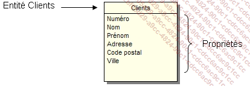

Quelques definitions :
-   entité forte: une entite qui ne depend pas d'une autre entite pour exister
-   entite faible: une entite qui depend d'une autre entite pour exister
#### Les relations 
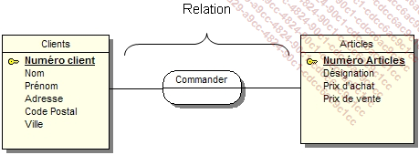
#### **Les cardinalités**: elles permettent de définir le nombre d'occurences d'une entité par rapport à une autre entité dans le cadre d'une relation.


Petit Exemple : 
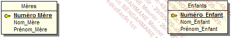
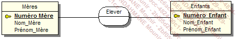
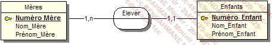

#### Les relations "porteuses"
Une relation est dite porteuse si elle possede des proprietés

#### Les relations "reflexives"
Une relation est dite reflexive si elle relie une 

Quelques regles de conception :

-   Toute entité doit avoir un identifiant
-   Toutes les proprietes dependent fonctionnellement de l'identifiant
-   Le nom d'une propriété ne doit apparaitre qu'une seul fois dans le MCD : si vous avez une entité Elevé et une entité proffesseur, vous ne pouvez pas avoir une propriété nom dans les deux entités. Il faut donc renommer le propriété nom de l'entité Professeur en nomProfesseur par exemple.
-   Les propriétés issues d'un calcule ne doivent pas apparaitre dans le MCD.

#### Les contrainte d'integrité fcontionnelle (CIF)

Définitions : une CIF est définie par le fait qu'une des entités de l'association est completement determinée par la connaissance d'une ou plusieurs entités participant a l'association.

Expemple :

Une salle peut contenir 0 ou plusieurs ordinateurs. Un ordinateur existe dans une et une seule salle. 
Dans ce type de type de relation une CIF existe si on a une cardinalité 1,1.

### Modèle Logique des données (MLD)

Le MLD est la suite du processus Merise, On se rapproche un peu plus de la base de données.

#### Cas simple

Partons du MCD suivant :
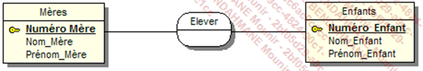

Nous arrivons au MDL suivant :
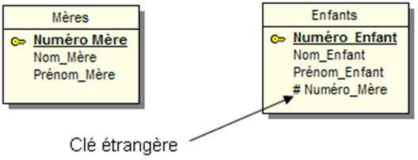

L'`entité` qui possède la cardinalite 1
,1 ou 0,1 absorbe l'identifiant de l'entite la plus forte (0,n ou 1,n). Cet identifiant devient alors une clé etrengere 

#### Cas (0,n), (0,n) ou (1,n) (1,n)

Partons du MCD suivant : 
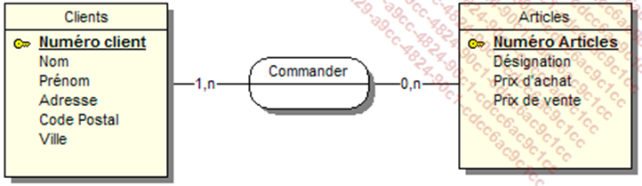

Dans le cas ou la `cardinalité max` est n des deux cotés, on crée une entite intermediaire qui va contenir les deux clée etrangères des deux entités.


Continuons avec le MCD suivent :
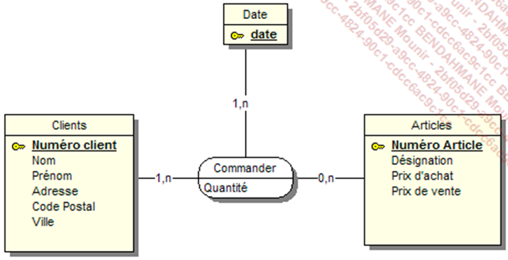

One obtient le MLD suivant en suivant la meme logique :
  

#### Cas d'une relation reflexive

Partons du MCD suivent ;
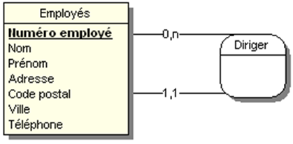


#### Regles de passage du MCD au MDL

Règles simples de passage du MCD au MLD
L’entité qui possède la cardinalité maximale égale à 1 recevra l’identifiant ou les identifiants des entités ayant les cardinalités maximales les plus fortes.

 

Les relations ayant toutes leurs entités reliées avec des cardinalités maximales supérieures à 1 se transformeront en entité en absorbant les identifiants des entités jointes.

 

Toute relation porteuse de propriétés se transformera en entité et absorbera comme clé étrangère les identifiants des entités qui lui sont liées.

 

Toute relation réflexive se transformera en entité et absorbera comme clé étrangère l’identifiant de l’entité qui lui est liée.

#### Petie exercice pratique :

A partrir du MCD suivant construisez le MLD :

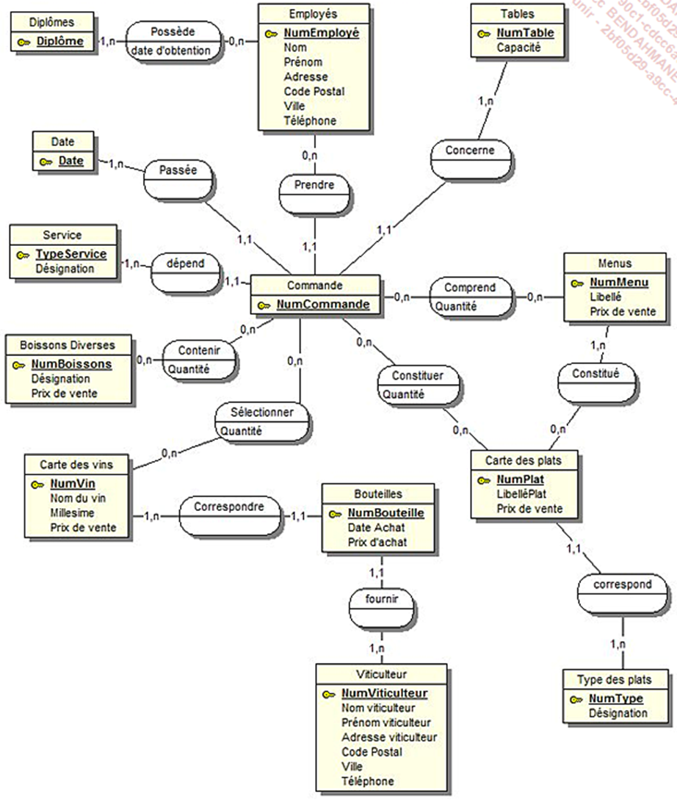

Voici le MLD :

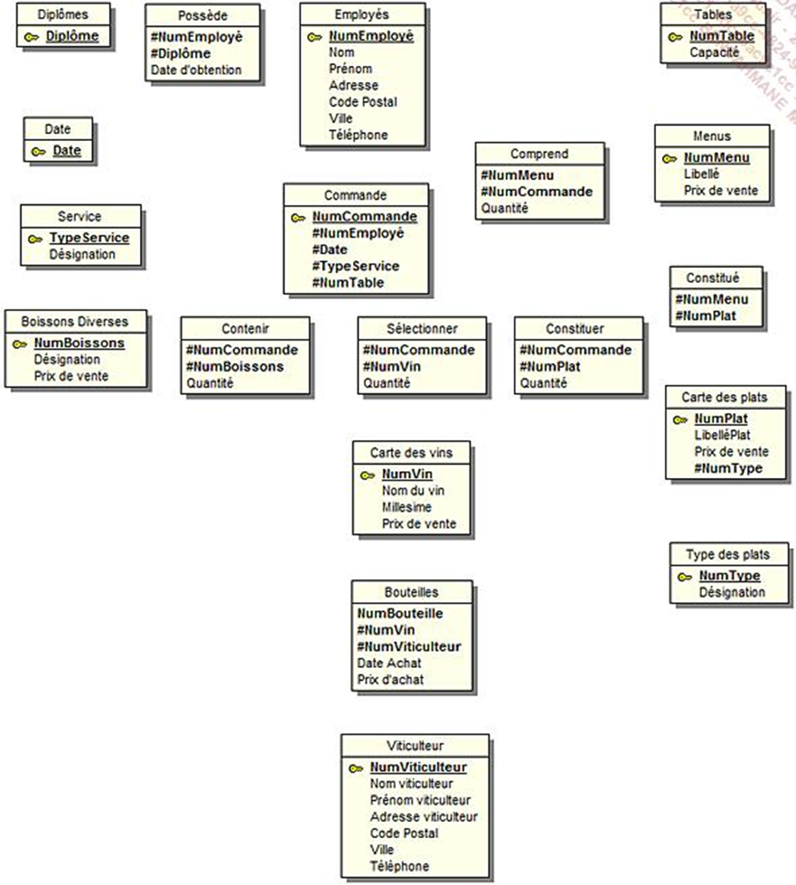


### Modele phisyque de données (MDP)

Voici le schema relationnel correspondant au MLD precedent :

Diplômes (Diplomes)

Possède (#NumEmployé, #Diplôme, Date d’obtention)

Employés (NumEmployé, Nom, Prénom, Adresse, Code Postal, Ville, Téléphone)

Tables (NumTable, Capacité)

Date (Date)

Service (TypeService, Désignation)

Boissons Diverses (NumBoissons, Désignation, Prix de vente)

Contenir (#NumCommande, #NumBoissons, Quantité)

Commande (NumCommande, #Numemployé, #Date, #TypeService, #NumTable)

Comprend (#NumMenu, #NumCommande, Quantité)

Menus (NumMenu, Libellé, Prix de vente)

Constitué (#NumMenu, #NumPlat)

Constituer (#NumCommande, #NumPlat, Quantité)

Sélectionner (#NumCommande, #NumVin, Quantité)

Carte des vins (NumVin, Nom du vin, Millesime, Prix de vente)

Carte des plats (NumPlat, LibelléPlat, Prix de vente, #NumType)

Type des plats (NumType, Désignation)

Bouteilles (NumBouteille, Date Achat, Prix d’achat, # NumVin, #NumViticulteur)

Viticulteur (NumViticulteur, Nom viticulteur, Prénom viticulteur, Adresse viticulteur, Code postal, Ville, Téléphone)

**ET**
```sql
CREATE TABLE CARTE_DES_VINS
   (
   NUMVIN INTEGER(2) NOT NULL ,
   NOM_DU_VIN CHAR(40)   ,
   MILLESIME INTEGER(2)  ,
   PRIX_DE_VENTE REAL(5,2)
,
    PRIMARY KEY (NUMVIN) CONSTRAINT PK_CARTE_DES_VINS
   );

CREATE TABLE BOUTEILLES
   (
   NUMVITICULTEUR INTEGER(2) NOT NULL ,
   NUMVIN INTEGER(2) NOT NULL ,
   NUMBOUTEILLE INTEGER(2) NOT NULL ,
   DATE_ACHAT DATE(8) ,
   PRIX_D_ACHAT REAL(5,2)
,
    PRIMARY KEY (NUMVITICULTEUR, NUMVIN, NUMBOUTEILLE) CONSTRAINT
PK_BOUTEILLES
   );


CREATE TABLE VITICULTEUR
   (
   NUMVITICULTEUR INTEGER(2) NOT NULL ,
   NOM_VITICULTEUR CHAR(20) ,
   PRÉNOM_VITICULTEUR CHAR(20) ,
   ADRESSE_VITICULTEUR CHAR(40) ,
   CODE_POSTAL CHAR(5) ,
   VILLE CHAR(40) ,
   TÉLÉPHONE CHAR(15)
,
    PRIMARY KEY (NUMVITICULTEUR) CONSTRAINT PK_VITICULTEUR
   );
   ```


   ### Exercices

   #### Exercice 1

   MCD :
   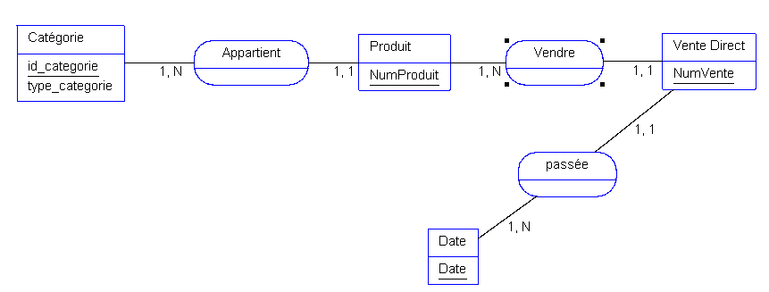

   MLD :
   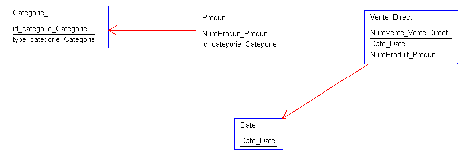

   MDP :

     Date (Date_Date)  
     Catégorie (id_categorie_Catégorie_, type_categorie_Catégorie_)  
     Produit (NumProduit_Produit, id_categorie_Catégorie_) 
     Vente Direct (NumVente, Date, NumProduit)

     SQL :

     ```sql
     CREATE TABLE Vente_Direct 
     (NumVente_Vente Direct INT AUTO_INCREMENT NOT NULL, 
     Date_Date DATETIME, 
     NumProduit_Produit VARCHAR, 
     PRIMARY KEY (NumVente) CONSTRAINT PK_Vente_Direct
     );  
     
     CREATE TABLE Date 
     (Date_Date DATETIME AUTO_INCREMENT NOT NULL, 
     PRIMARY KEY (Date_) CONSTRAINT PK_Date
     );  
     
     CREATE TABLE Catégorie 
     (id_categorie_Catégorie  INT AUTO_INCREMENT NOT NULL, 
     type_categorie_Catégorie  VARCHAR, 
     PRIMARY KEY (id_categorie) CONSTRAINT PK_Catégorie
     );  
     
     CREATE TABLE Produit 
     (NumProduit_Produit INT AUTO_INCREMENT NOT NULL, 
     id_categorie_Catégorie  INT, 
     PRIMARY KEY (NumProduit) CONSTRAINT PK_Produit
     );  
     
     ALTER TABLE Vente_Direct ADD CONSTRAINT FK_Vente_Direct_Date_Date FOREIGN KEY (Date_Date) REFERENCES Date (Date_Date); 
     
     ALTER TABLE Vente_Direct ADD CONSTRAINT FK_Vente_Direct_NumProduit_Produit FOREIGN KEY (NumProduit_Produit) REFERENCES Produit (NumProduit_Produit); 
     
     ALTER TABLE Produit ADD CONSTRAINT FK_Produit_id_categorie_Catégorie_ FOREIGN KEY (id_categorie_Catégorie_) REFERENCES Catégorie_ (id_categorie_Catégorie_); 
     ```


